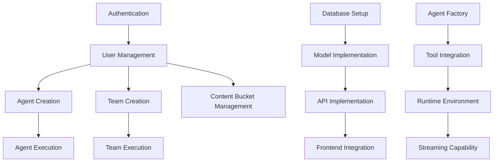
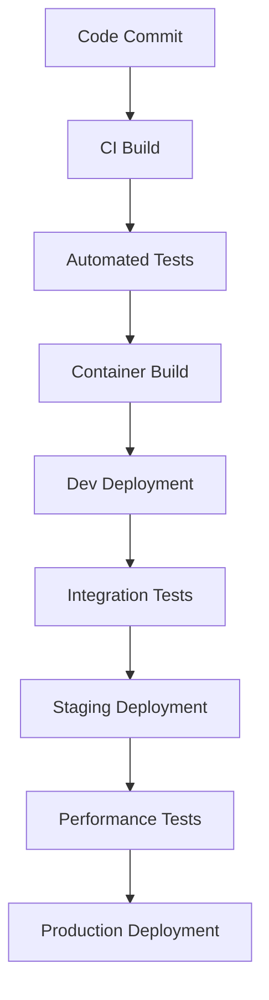

# Mindloom – Enhanced Product Requirements Document (v0.2)

## 1. Executive Summary

Mindloom provides a no-code platform for creating AI Agents, AI Teams, and AI Workflows that can be instructed to complete tasks using tools and reasoning. Users can upload structured data that can be used for an Agents knowledge, and download artifacts created by agents such as generated reports, code, diagrams, and images. Using tools, office workers can dynamically spin up "coworkers" to complete tasks that would otherwise take much longer to complete.

## 2. Background and Current State

- There exists a proof-of-concept frontend written using bolt.new with
  - Vite JS
  - Tailwind CSS
  - React JS
- Current capabilities are visual only, as there is no persisted backend or API:
  - Create an Agent based on a Agent Template, which autofills the Agent config fields
  - Create an Agent from scratch
    - Provide instructions for the Agent
    - Enable/disable tools
    - Define variables to be entered at runtime
    - Optionally scheduling when the Agent should run
    - Link "Content Buckets" which represent a set of uploaded data to be used as the Agents knowledge base via a vector database
  - Create a Team of Agents
    - Provide a Team name, description
    - Variables to be entered at runtime
    - Team type - Route, Coordinate or Collaborate
    - Assign up to five existing Agents to a team
    - Link "Content Buckets" which represent a set of uploaded data to be used as the teams knowledge base via a vector database
  - Create a Content Bucket
    - Content Buckets represent an object that contains a set of files (PDF, TXT, MD) that can be associated with any number of Agents or Teams of Agents. In the backend, this is done by creating a vector database for the given Agent or Team of Agents and uses an embedder to enter the data for RAG
  - View Agent or Team of Agent runs in a table display, so users can see all historical executions of Agents or Teams of Agents
- Known existing limitations or tech debt:
  - The proof of concept used Supabase for persistence, it must be migrated to just PostgreSQL
  - User authentication is not setup correctly
  - The backend does not yet exist
  - The concept of an Agent Workflow is not yet implemented
    - An AI Workflow is a deterministic approach to a Team of Agents, instead of just defining the Agents, associating them as a Team with instructions and knowledge, Agent Workflows allow users to create explicit steps that must be completed in a specific order by agents. This allows the user to define when a hand off between agents will occur, when to pause for human intervention/review, when to use certain tools or third party integrations, and what a successful Agent Workflow run looks like. 
  - The concept of an Agent Inbox is not yet implemented
    - An Agent Inbox would be an interface of which users can receive "messages" from Agents outside of a chat box interface. Users should be able to trigger the run of an Agent, move their attention to another task, and revisit the UI when the Agent sends them a message in the form of a Agent Inbox message asking for task clarification, content review, or approval to execute a step that requires human eyes.

## 3. Problem Statement

Users should not need to have to know how to code to create an AI Agent that can assist the user in completing tasks. They should be able to have access to an accessible, clean UI that dynamically creates agents based on user input.

## 4. Goals & Non‑goals

| Goals (must‑haves)                                      | Non‑goals (out of scope)                                  |
| ------------------------------------------------------- | --------------------------------------------------------- |
| Create Agents, Teams and Workflows via a UI             |                                                           |
| Monitor, observe, and interact with the output of a Run | Agent tracing, fine-tuning, or advanced LLM customization |

## 5. Personas

| Persona       | Archetype            | Primary Needs                                     |
| ------------- | -------------------- | ------------------------------------------------- |
| Employee      | Creation, execution  | Running Agents to complete tasks                  |
| Administrator | Control, observation | Enforce secure guardrails, observe Agent behavior |

## 6. Functional Requirements

### 6.1 Frontend Expansion

1. **Agent artifact retrieval** - After an agent completes running, Employees should be able to download the run artifact that contains the logs for the run execution along with any PDF's, TXT, MD, or other files that the agent created during the run
2. **Live streaming logs -** During the execution of an Agent, Team, or Workflow run, Employees should be able to view the output of the agent run. This would include tool usage, agent handoffs (if it is a Team or Workflow), manual approval gates, Agent outputs, and Agent reasoning CoT's. 
3. **Settings with Credentials** - Employees should be able to enter credentials or otherwise authenticate with third party services that Agents will interact with. The initial set of services will be GitHub, JIRA, and ServiceNow
4. **Administrative Interface** - Admins should be able to delete Agents, Teams, Workflows
5. **Administrative Observability Interface** - Administrators should be able to view all Runs, including the time it took to execute, the amount of tokens inputted/outputted, a audit log of tool calls, and access to run logs and artifacts
6. **User Authentication/Department** - Employees should be able to log in, log out, sign in, sign up, and associate themselves with a department (Marketing, Finance, Tech)
7. ***SECOND MILESTONE*** **Agent Workflows** - Employees should be able to create an Agent Workflow, which would be displayed as a sort of graph builder, connecting and creating nodes that represent either an Agent, Team, explicit tool call, manual step, or success criteria.
8. ***SECOND MILESTONE*** **Agent Inbox** - Employees should be able to have a centralized page where any number of agents can communicate with the employee via sending a message to the employees Agent Inbox, which resembles and Email inbox but only consists of messages from Agents asking for approval to move on to a gated step, request for material review, or notifying that the Agent has completed their Run.

### 6.2 Backend Build-out

1. **API  -** The frontend should have a Python 3.12 REST API with async capabilities powered by the FastAPI framework
   1. REST API endpoint for client communication
   2. Thread management for conversations
   3. LLM integration through AzureAI
   4. Agent creation and execution using the Agno AI framework and PostgreSQL
   5. Agent Teams creating, execution and storage using the Agno AI framework and PostgreSQL
   6. Agent Workflow creation, execution and storage using the Agno AI framework and PostgreSQL
2. **Authn/Authz** – JWT authentication with RBAC to control whether a user is an Employee or Adminstrator
3. **Persistence** – PostgreSQL for persistence, with a Redis database for short-lived data persistence of which the front end can poll from directly.
   1. User authentication and management
   2. Conversation history storage
   3. File storage for uploads and agent-generated files
   4. Agent state persistence
   5. Analytics tracking
   6. Real-time subscriptions for updates
4. **Core Services**
   1. Agent Factory and Runtime - This component manages the lifecycle of agent runs, using the Agno agent library to create Agents ([https://docs.agno.com/agents/introduction](https://docs.agno.com/agents/introduction)). The runtime is a wrapper around the Agno library to ensure we can stream responses, store Agent/Team definitions in the database, and spin up as many agents as are being requested. The Agno library provides a framework for most of the Agent specifics, listed below:

      1. Agent run execution
      2. Agent sessions
      3. Agent state
      4. Memory
      5. Tools
      6. Structured Output
      7. Prompts
      8. Session storage
      9. Agent Context

   2. The ContextManager ensures that agents do not exceed their context window. When it sees it is approaching or exceeding the token count, it generates a summary of the run so far and adds it to the Agents Memory using Agno AI ([https://docs.agno.com/memory/storage](https://docs.agno.com/memory/storage))

   3. The Response Processing system handles the transformation of raw Agent responses into structured outputs, tool executions, and properly formatted messages. This critical component acts as the bridge between language model responses and agent actions, managing both streaming and non-streaming responses, tool call detection and execution, and consistent error handling.
5. **Admin and Operations Endpoints**
   1. CRUD operations against all Agents and Teams
   2. User management
   3. Add third party services

## 7. Non-functional Requirements

- p95 latency < **300ms**
- 99.9% uptime monthly
- Hard multi‑tenant isolation
- Observability: JSON Logging, Agent traces

## 8. Architecture Sketch

```
[user] ⇄ https ⇄ [frontend (edge)] ⇄ [api gw] → [auth]
                                      ↘︎ [core svc] ↔ [db]
                                              ↘︎ [external apis]
```

## 9. API Surface (v1)

Note: v2 will include Agent Workflows and the Agent Inbox

| Category | Method | Endpoint                       | Auth   | Request Body                                                             | Success Response                            |
| -------- | ------ | ------------------------------ | ------ | ------------------------------------------------------------------------ | ------------------------------------------- |
| auth     | POST   | /api/auth/login                | none   | email, password                                                          | 200 → access\_token, refresh\_token, user{} |
| auth     | POST   | /api/auth/register             | none   | email, password, name                                                    | 201 → user{}                                |
| agents   | GET    | /api/agents                    | bearer | –                                                                        | 200 → agents[], pagination\_meta            |
| agents   | POST   | /api/agents                    | bearer | name, description, icon, category, instructions, variables[], schedule{} | 201 → agent{}                               |
| agents   | POST   | /api/agents/{agent\_id}/start  | bearer | –                                                                        | 202 → run{} started                         |
| agents   | POST   | /api/agents/{agent\_id}/stop   | bearer | –                                                                        | 200 → run{} stopped                         |
| agents   | GET    | /api/agents/{agent\_id}/stream | bearer | –                                                                        | 200 → event‑stream                          |
| teams    | GET    | /api/teams                     | bearer | –                                                                        | 200 → teams[]                               |
| teams    | POST   | /api/teams                     | bearer | name, description, type, agents[]                                        | 201 → team{}                                |
| teams    | POST   | /api/teams/{team\_id}/start    | bearer | –                                                                        | 202 → run{} started                         |
| teams    | POST   | /api/teams/{team\_id}/stop     | bearer | –                                                                        | 200 → run{} stopped                         |
| teams    | GET    | /api/teams/{team\_id}/stream   | bearer | –                                                                        | 200 → event‑stream                          |
| runs     | GET    | /api/runs                      | bearer | –                                                                        | 200 → runs[], pagination\_meta              |
| runs     | POST   | /api/runs                      | bearer | type, target\_id, variables{}, stream\_logs, scheduled\_time             | 201 → run{}                                 |

## 10. Data Model

### Database Schema

#### Users

```sql
CREATE TABLE users (
  id UUID PRIMARY KEY DEFAULT gen_random_uuid(),
  email TEXT UNIQUE NOT NULL,
  name TEXT NOT NULL,
  avatar_url TEXT,
  password_hash TEXT NOT NULL,
  created_at TIMESTAMPTZ NOT NULL DEFAULT NOW(),
  updated_at TIMESTAMPTZ NOT NULL DEFAULT NOW()
);
```

#### Agents

```sql
CREATE TABLE agents (
  id UUID PRIMARY KEY DEFAULT gen_random_uuid(),
  name TEXT NOT NULL,
  description TEXT,
  icon TEXT NOT NULL,
  category TEXT NOT NULL,
  instructions TEXT,
  is_custom BOOLEAN DEFAULT false,
  user_id UUID NOT NULL REFERENCES users(id),
  created_at TIMESTAMPTZ NOT NULL DEFAULT NOW(),
  updated_at TIMESTAMPTZ NOT NULL DEFAULT NOW()
);
```

#### Teams

```sql
CREATE TABLE teams (
  id UUID PRIMARY KEY DEFAULT gen_random_uuid(),
  name TEXT NOT NULL,
  description TEXT,
  type TEXT NOT NULL,
  user_id UUID NOT NULL REFERENCES users(id),
  created_at TIMESTAMPTZ NOT NULL DEFAULT NOW(),
  updated_at TIMESTAMPTZ NOT NULL DEFAULT NOW()
);
```

#### Runs

```sql
CREATE TABLE runs (
  id UUID PRIMARY KEY DEFAULT gen_random_uuid(),
  type TEXT NOT NULL,
  target_id UUID NOT NULL,
  status TEXT NOT NULL,
  start_time TIMESTAMPTZ NOT NULL,
  end_time TIMESTAMPTZ,
  triggered_by_id UUID NOT NULL REFERENCES users(id),
  created_at TIMESTAMPTZ NOT NULL DEFAULT NOW()
);
```

### Entity Relationships

```mermaid
graph TD
    USERS ||--o{ AGENTS : creates
    USERS ||--o{ TEAMS : creates
    USERS ||--o{ RUNS : triggers
    AGENTS ||--o{ AGENT_VARIABLES : has
    AGENTS ||--o{ AGENT_SCHEDULES : has
    TEAMS ||--o{ TEAM_AGENTS : contains
    AGENTS ||--o{ TEAM_AGENTS : belongs_to
    RUNS ||--o{ RUN_LOGS : generates
    RUNS ||--o{ RUN_ARTIFACTS : produces
```

## 11. Task Prioritization Framework

To guide development sequence and resource allocation, we'll use the following priority levels:

| Priority Level | Description | Criteria |
|----------------|-------------|----------|
| P0 | Critical Path | Core functionality without which the system cannot function |
| P1 | High Value | Features essential for MVP release |
| P2 | Important | Features needed before public release |
| P3 | Nice to Have | Features that can be deferred to future releases |

For the milestones already defined:
- MVP Backend (P0): Authentication, Database, Core API
- Frontend v2 (P1): Agent/Team creation, Run management, Streaming logs
- Beta Release (P1): Performance optimization, Security hardening
- Second Milestone Features (P2): Agent Workflows, Agent Inbox

## 12. Component Dependencies Map



## 13. Definition of Done Criteria

For each task type:

**Backend Components:**
- Passes all unit and integration tests
- API documentation updated
- Performance meets latency requirements (p95 < 300ms)
- Logging implemented
- Code reviewed
- Security reviewed

**Frontend Components:**
- UI implementation matches design
- Responsive across supported devices
- Accessibility requirements met
- All user flows tested
- Performance meets benchmarks

**Integration Features:**
- End-to-end testing complete
- Error handling verified
- Documentation updated

## 14. Testing Strategy

| Component | Testing Approach | Tools |
|-----------|------------------|-------|
| Backend API | Unit tests, API tests | pytest, requests |
| Database | Schema validation tests | pytest-postgresql |
| Authentication | Security testing | OWASP ZAP |
| Frontend | Component tests, E2E tests | React Testing Library, Cypress |
| Integration | E2E workflow tests | Cypress |
| Performance | Load testing | k6, Artillery |

## 15. UI/UX Specifications

1. **Design System**: Define core UI components, typography, colors
2. **Wireframes**: For each major screen:
   - Agent creation/editing
   - Team management
   - Run monitoring interfaces
   - Agent Inbox (future)
   - Workflow builder (future)
3. **User Flow Diagrams**: Document the steps users take to accomplish goals
4. **Responsive Design Requirements**: Define behavior across device types

## 16. Resource Allocation & RACI Matrix

| Component | Responsible | Accountable | Consulted | Informed |
|-----------|-------------|-------------|-----------|----------|
| Backend Core | Backend Dev | Tech Lead | Product Manager | Design Team |
| Frontend | Frontend Dev | Tech Lead | UX Designer | Product Manager |
| Database | DB Engineer | Tech Lead | Backend Dev | Infrastructure |
| DevOps | DevOps Engineer | Tech Lead | Security | Product Manager |

## 17. Technical Implementation Guidelines

### Agent Factory Implementation:

1. Create abstract `AgentFactory` class that implements Agno interfaces
2. Implement concrete factories for each agent type
3. Define standard interaction patterns with LLM APIs
4. Implement context management using windowing techniques
5. Create tool registry and execution pipeline

### Response Processing:

1. Implement parsers for structured LLM outputs
2. Create streaming response handlers
3. Build tool call detection and execution pipeline
4. Implement error recovery strategies

## 18. Error Handling Strategy

| Error Type | Strategy | Example |
|------------|----------|---------|
| Authentication | Retry with exponential backoff | JWT expiration |
| External API | Circuit breaker pattern | Third-party service unavailable |
| LLM Errors | Graceful degradation | Model returns error format |
| Data Validation | Clear user feedback | Invalid agent configuration |
| Runtime Errors | Automatic recovery with logging | Agent execution timeout |

## 19. Deployment Pipeline



Tools: GitHub Actions, Docker, Helm, ArgoCD

## 20. Data Migration Strategy

1. **POC to Production**:
   - Create schema migration scripts
   - Export/transform POC Supabase data
   - Validation procedures for data integrity
   - Rollback procedures

2. **Version Upgrades**:
   - Schema versioning approach
   - Backward compatibility requirements
   - Blue/green deployment strategy

## 21. Success Criteria Per Feature

Example for Agent Creation:
```
Feature: Agent Creation
Success Criteria:
- Users can create an agent in < 3 minutes
- Agent configuration persists correctly
- All tool options are available
- Variables are correctly defined and applied
- Success rate of agent creation > 99%
- Error messages are clear and actionable
```

## 22. User Journey Maps

Create detailed flows for key personas:

**Employee Journey**: Creating and Running an Agent
1. Login → Browse Templates → Select Template → Configure Agent → Test Run → Review Output → Make Adjustments → Production Run → Download Artifacts

**Administrator Journey**: Monitoring Agent Usage
1. Login → View Dashboard → Review Metrics → Inspect Problematic Runs → Adjust Policies → Generate Reports

## 23. Security Requirements

1. **Data Protection**:
   - At-rest encryption for all stored data
   - TLS 1.3 for all communications
   - Encryption of sensitive settings/credentials

2. **Authorization Model**:
   - Role-based access control
   - Least privilege principle
   - Resource ownership model
   - Department-based isolation

3. **Security Monitoring**:
   - Authentication attempt monitoring
   - Unusual usage pattern detection
   - Tool usage auditing

## 24. Monitoring and Logging Strategy

1. **System Metrics**:
   - API latency (p50, p95, p99)
   - Error rates by endpoint
   - Database performance
   - Redis cache hit ratio

2. **Business Metrics**:
   - Agent runs per day/week
   - Success rate of runs
   - Agent creation rate
   - Team utilization

3. **Logging Format**:
   - Structured JSON logs
   - Consistent correlation IDs
   - Sanitized sensitive information
   - Log levels and retention policy

## 25. Milestones & T-Shirt Sizing

ETA's are shortened as this is being developed with an LLM using Windsurf and not hand written.

| Phase       | Scope                | ETA | Owner |
| ----------- | -------------------- | --- | ----- |
| MVP Backend | API + DB + Auth      | 2d  | DevX  |
| FE v2       | UI Polish, Feature X | 2d  | DevX  |
| Beta        | Perf + Sec Hardening | 2d  | DevX  |

## 26. Success Metrics

- Agents ran growth week over week
- Error rate < **5%** (corrected from original 95%)

## 27. Risks

| Risk        | Prob | Impact | Mitigation            |
| ----------- | ---- | ------ | --------------------- |
| Scale unk   | M    | H      | Load‑test + autoscale |
| Scope creep | H    | M      | Rigid goals           |

## 28. Open Questions

1. This will be hosted on Kubernetes, so we will need to dockerize it and supply a Helm chart that can install the service, PostgreSQL, PGVector for Agent Knowledge, and Redis for pub/sub.
2. Analytics stack will be confirmed after the initial backend creation

---
*Last updated: 2025-04-28*