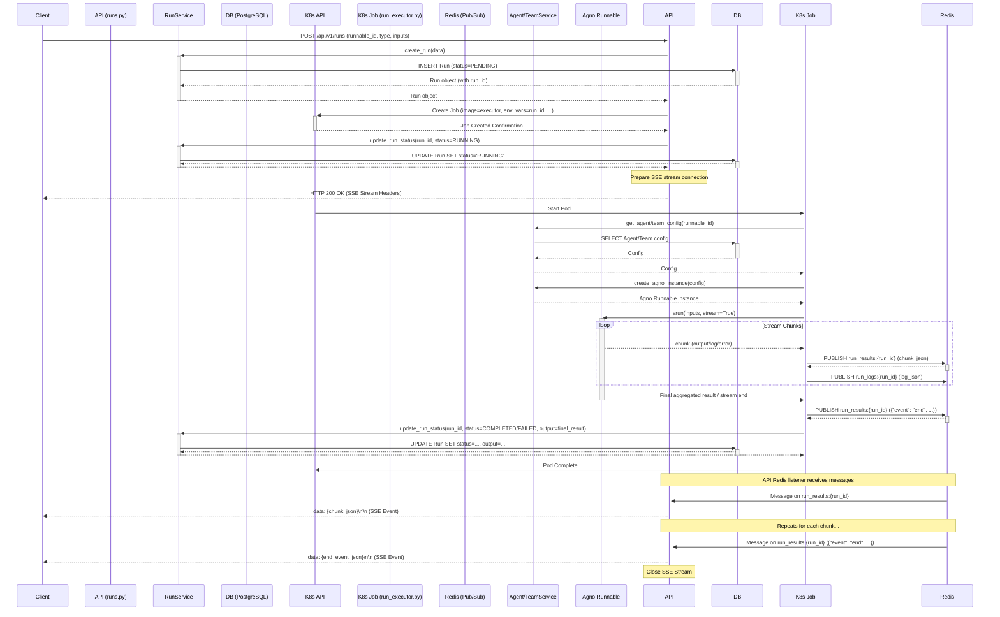

# MindLoom Backend Design Document

## 1. Overview

The MindLoom backend provides a RESTful API for managing and executing AI agents and teams built with the Agno library. It orchestrates the creation, configuration, execution, and monitoring of these AI entities.

The architecture emphasizes:
*   **Modularity:** Separating concerns into API endpoints, services, data models, and execution logic.
*   **Scalability:** Leveraging Kubernetes for running AI tasks as isolated jobs.
*   **Real-time Feedback:** Using Redis Pub/Sub, WebSockets, and Server-Sent Events for streaming logs and results.
*   **Persistence:** Storing configurations and run history in a PostgreSQL database.

## 2. Core Components

*   **FastAPI Application:** The main entry point, handling HTTP requests, routing, dependency injection, and data validation (Pydantic).
*   **API Endpoints (`/api/v1/`):** Defines routes for managing Agents, Teams, Runs, etc.
*   **Services (`mindloom.services`):** Encapsulates business logic for interacting with Agents, Teams, Runs, and external systems (Database, Redis, Kubernetes, Agno).
    *   `AgentService`: Handles CRUD operations for agents, validation, and AgnoAgent instantiation.
    *   `TeamService`: Handles CRUD for teams, validation, and AgnoTeam instantiation.
    *   `RunService`: Manages run records in the database (CRUD, status updates).
    *   `redis_service`: Provides access to the configured Redis client pool.
*   **Database (`mindloom.db`):** Uses SQLAlchemy (asyncpg) for interacting with the PostgreSQL database. Defines ORM models for Agents, Teams, Runs, etc. Alembic is used for migrations.
*   **Redis:** Used for:
    *   **Pub/Sub:** Streaming logs (`run_logs:{run_id}`) and results (`run_results:{run_id}`) from execution jobs back to the API.
    *   **Caching (Potential):** Can be used for caching frequently accessed data.
    *   **Team Memory (Agno):** `RedisMemoryDb` is used by Agno for team communication/memory persistence.
*   **Kubernetes Integration:** The `/run` endpoint dynamically creates Kubernetes Jobs to execute the `run_executor.py` script for each agent/team run.
*   **Run Executor (`mindloom.execution.run_executor.py`):** A standalone script executed within a Kubernetes Job. It:
    *   Receives run parameters (run ID, runnable ID, type, inputs) via environment variables.
    *   Connects to the Database and Redis.
    *   Instantiates the appropriate `AgnoAgent` or `AgnoTeam` using `AgentService` or `TeamService`.
    *   Executes the agent/team using `arun(stream=True)`.
    *   Publishes logs via a Redis handler.
    *   Publishes result chunks to the `run_results:{run_id}` Redis channel.
    *   Updates the final run status and output/error in the Database.
*   **Agno Library:** The core AI framework providing the `AgnoAgent` and `AgnoTeam` classes, tools, memory management, etc.

## 3. Key Workflows

### 3.1 Agent/Team Creation & Management

1.  **Client** sends `POST /api/v1/agents` (or `/teams`) with configuration data.
2.  **FastAPI Endpoint** receives the request, validates data using Pydantic models.
3.  Endpoint calls the corresponding **Service** (`AgentService`/`TeamService`).
4.  **Service** performs business logic validation (e.g., ensuring model compatibility).
5.  Service interacts with the **Database** via SQLAlchemy to create/update the Agent/Team record.
6.  Service returns the created/updated ORM model.
7.  **Endpoint** converts the ORM model back to a Pydantic schema and returns it to the client.

### 3.2 Run Execution & Streaming

**Flow Description:**

1.  **Initiation:** Client sends a request to start a run.
2.  **DB Record:** The API creates a `Run` record in the database with `PENDING` status via `RunService`.
3.  **Job Launch:** The API defines and launches a Kubernetes Job, passing necessary info (like `run_id`) as environment variables.
4.  **Status Update:** API updates the Run status to `RUNNING`.
5.  **SSE Connection:** API establishes an SSE connection back to the client.
6.  **Executor Start:** The K8s Job pod starts `run_executor.py`.
7.  **Instantiation:** The executor fetches the Agent/Team config and instantiates the Agno runnable using the relevant service.
8.  **Execution:** The executor calls `arun(stream=True)` on the Agno runnable.
9.  **Chunk Publishing:** As the Agno runnable yields chunks, the executor publishes them as JSON to the `run_results:{run_id}` Redis channel.
10. **Log Publishing:** Logs generated within the executor are published to `run_logs:{run_id}` via a custom logging handler.
11. **API Streaming:** The API (specifically the `_stream_run_results` generator) is subscribed to `run_results:{run_id}`. It receives the JSON chunks and forwards them to the client as SSE `data` events.
12. **Completion:** When the stream ends, the executor publishes a final `{"event": "end"}` message to Redis.
13. **Final DB Update:** The executor updates the Run record in the database with the final status (`COMPLETED` or `FAILED`) and the aggregated output/error via `RunService`.
14. **Job End:** The Kubernetes Job completes.
15. **Stream Closure:** The API receives the "end" event and closes the SSE connection to the client.

## 4. Data Models (Illustrative)

*   **Agent:** `id`, `name`, `description`, `model_config`, `tool_config`, `knowledge_config`, `storage_config`, `created_at`, `updated_at`.
*   **Team:** `id`, `name`, `description`, `leader_agent_id`, `member_agent_ids`, `knowledge_config`, `storage_config`, `created_at`, `updated_at`.
*   **Run:** `id`, `runnable_id`, `runnable_type` (agent/team), `status` (PENDING, RUNNING, COMPLETED, FAILED), `input_variables`, `output_data`, `error_message`, `started_at`, `ended_at`.

## 5. Technology Choices & Rationale

*   **FastAPI:** High performance, async support, automatic docs, Pydantic integration.
*   **PostgreSQL:** Robust relational database, supports JSONB for flexible config storage.
*   **Redis:** Excellent for Pub/Sub messaging required for real-time features, fast caching.
*   **Kubernetes:** Standard for container orchestration, allows scalable and isolated execution of potentially long-running AI tasks.
*   **SQLAlchemy:** Mature ORM for Python, provides async support via `asyncpg`.
*   **SSE:** Simple, standard protocol for server-to-client streaming over HTTP, suitable for result streaming.
*   **WebSockets:** Used for log streaming, allowing bi-directional communication if needed in the future (though currently only server-to-client).

## 6. Future Considerations

*   **Authentication/Authorization:** Enhance security around API endpoints.
*   **Scalability:** Optimize database queries, potentially scale Redis/PostgreSQL.
*   **Executor Scaling:** Adjust Kubernetes resource requests/limits, consider auto-scaling for Job pods.
*   **Advanced Error Handling:** More granular error reporting and potential retry mechanisms.
*   **Metrics & Monitoring:** Integrate with monitoring tools (e.g., Prometheus, Grafana).
