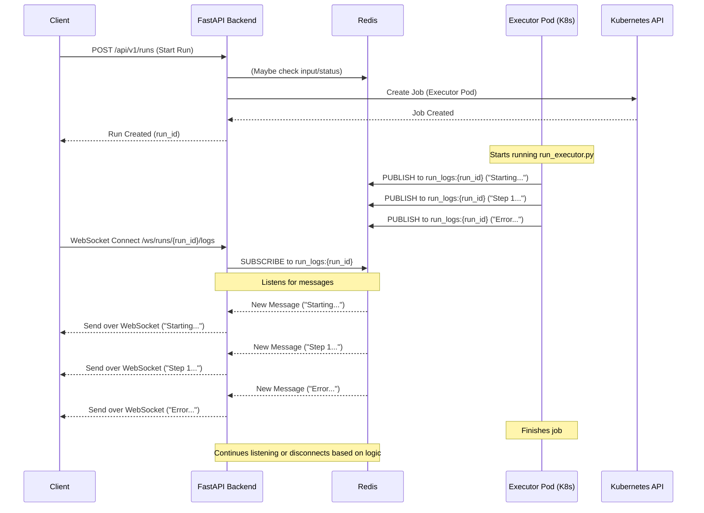

# Execution Flow

```mermaid
sequenceDiagram
    participant Client
    participant FastAPI Backend
    participant Redis
    participant Executor Pod (K8s)

    Client->>FastAPI Backend: POST /api/v1/runs (Start Run)
    FastAPI Backend->>Redis: (Maybe check input/status)
    FastAPI Backend->>Kubernetes API: Create Job (Executor Pod)
    Kubernetes API-->>FastAPI Backend: Job Created
    FastAPI Backend-->>Client: Run Created (run_id)

    Note over Executor Pod (K8s): Starts running run_executor.py
    Executor Pod (K8s)->>Redis: PUBLISH to run_logs:{run_id} ("Starting...")
    Executor Pod (K8s)->>Redis: PUBLISH to run_logs:{run_id} ("Step 1...")
    Executor Pod (K8s)->>Redis: PUBLISH to run_logs:{run_id} ("Error...")

    Client->>FastAPI Backend: WebSocket Connect /ws/runs/{run_id}/logs
    FastAPI Backend->>Redis: SUBSCRIBE to run_logs:{run_id}
    Note over FastAPI Backend, Redis: Listens for messages

    Redis-->>FastAPI Backend: New Message ("Starting...")
    FastAPI Backend-->>Client: Send over WebSocket ("Starting...")
    Redis-->>FastAPI Backend: New Message ("Step 1...")
    FastAPI Backend-->>Client: Send over WebSocket ("Step 1...")
    Redis-->>FastAPI Backend: New Message ("Error...")
    FastAPI Backend-->>Client: Send over WebSocket ("Error...")

    Note over Executor Pod (K8s): Finishes job
    Note over FastAPI Backend, Redis: Continues listening or disconnects based on logic
```