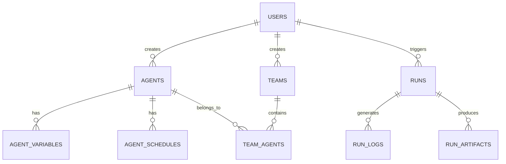

# Data Models

## Database Schema

### Users
```sql
CREATE TABLE users (
  id UUID PRIMARY KEY DEFAULT gen_random_uuid(),
  email TEXT UNIQUE NOT NULL,
  name TEXT NOT NULL,
  avatar_url TEXT,
  password_hash TEXT NOT NULL,
  created_at TIMESTAMPTZ NOT NULL DEFAULT NOW(),
  updated_at TIMESTAMPTZ NOT NULL DEFAULT NOW()
);
```

### Agents
```sql
CREATE TABLE agents (
  id UUID PRIMARY KEY DEFAULT gen_random_uuid(),
  name TEXT NOT NULL,
  description TEXT,
  icon TEXT NOT NULL,
  category TEXT NOT NULL,
  instructions TEXT,
  is_custom BOOLEAN DEFAULT false,
  user_id UUID NOT NULL REFERENCES users(id),
  created_at TIMESTAMPTZ NOT NULL DEFAULT NOW(),
  updated_at TIMESTAMPTZ NOT NULL DEFAULT NOW()
);
```

### Teams
```sql
CREATE TABLE teams (
  id UUID PRIMARY KEY DEFAULT gen_random_uuid(),
  name TEXT NOT NULL,
  description TEXT,
  type TEXT NOT NULL,
  user_id UUID NOT NULL REFERENCES users(id),
  created_at TIMESTAMPTZ NOT NULL DEFAULT NOW(),
  updated_at TIMESTAMPTZ NOT NULL DEFAULT NOW()
);
```

### Runs
```sql
CREATE TABLE runs (
  id UUID PRIMARY KEY DEFAULT gen_random_uuid(),
  type TEXT NOT NULL,
  target_id UUID NOT NULL,
  status TEXT NOT NULL,
  start_time TIMESTAMPTZ NOT NULL,
  end_time TIMESTAMPTZ,
  triggered_by_id UUID NOT NULL REFERENCES users(id),
  created_at TIMESTAMPTZ NOT NULL DEFAULT NOW()
);
```

## Entity Relationships



## Data Types

### Agent Categories
```typescript
type AgentCategory = 
  | 'customer-service'
  | 'sales'
  | 'engineering'
  | 'support'
  | 'marketing'
  | 'it'
  | 'hr'
  | 'popular';
```

### Team Types
```typescript
type TeamType = 'route' | 'coordinate' | 'collaborate';
```

### Run Status
```typescript
type RunStatus = 'running' | 'completed' | 'failed';
```

### Schedule Frequency
```typescript
type ScheduleFrequency = 'hourly' | 'daily' | 'weekly' | 'monthly';
```